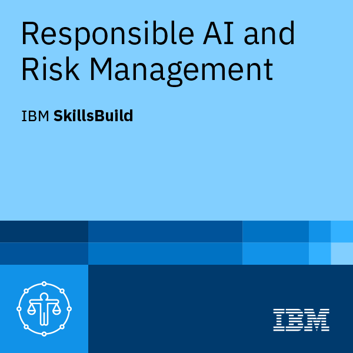

# Hi, I'm Francesca 👋

I am a **Backend Developer** with experience in developing microservices and REST APIs for the financial sector.

I mainly work with **Java, Spring Boot, Oracle, PL/SQL, MyBatis, and Groovy**, focusing on automated testing, database integration, and application maintenance.

## 💻 Core Skills

- **Backend:** Java, Spring Boot, REST APIs, MyBatis, Groovy
- **Databases:** Oracle, PL/SQL, SQL, MySQL
- **Testing:** JUnit, Spring Test, Postman
- **Tools:** Git, Maven, IntelliJ IDEA, Eclipse, Visual Studio Code
- **Methodologies:** Agile, Scrum

## 🚀 Experience

Since 2023, I have been working as a Backend Developer on enterprise applications and Java/Spring microservices in the financial sector.

My main responsibilities include:

- developing RESTful APIs;
- integrating applications and databases with MyBatis;
- writing automated tests with JUnit, Spring, and Groovy;
- managing and migrating data with PL/SQL;
- optimizing and maintaining Oracle views;
- collaborating within Agile/Scrum teams.

## ⛓️ Blockchain and Solidity

I am expanding my knowledge of smart contract development with **Solidity, Hardhat, and TypeScript**.

### Featured Project

- [Safe Escrow](https://github.com/Francescasan/safe-escrow) — a Solidity project focused on the secure management of an escrow contract.

## 🎓 Education

- **Master's Degree in Computer Science — Software Techniques curriculum** *(in progress)* — Alma Mater Studiorum, University of Bologna
- **Bachelor's Degree in Computer Science** — University of L'Aquila
- **Technical High School Diploma in Computer Science**
- Bachelor's thesis: use of the Gather Town platform for managing hybrid conferences

## 🏅 Certifications and Professional Training

- **IBM SkillsBuild — Responsible AI and Risk Management**
- Confluent — Fundamentals Accreditation
- Java Persistence using MyBatis
- Spring & Spring Boot
- MongoDB
- Oracle PL/SQL
- Python 3

## 🧠 Currently Learning

- Responsible AI and risk management
- Solidity and Web3 development
- Java 21 and Spring Boot
- Microservices, Docker, and Kubernetes

## 🌍 Languages

- Italian: Native
- English: B1
